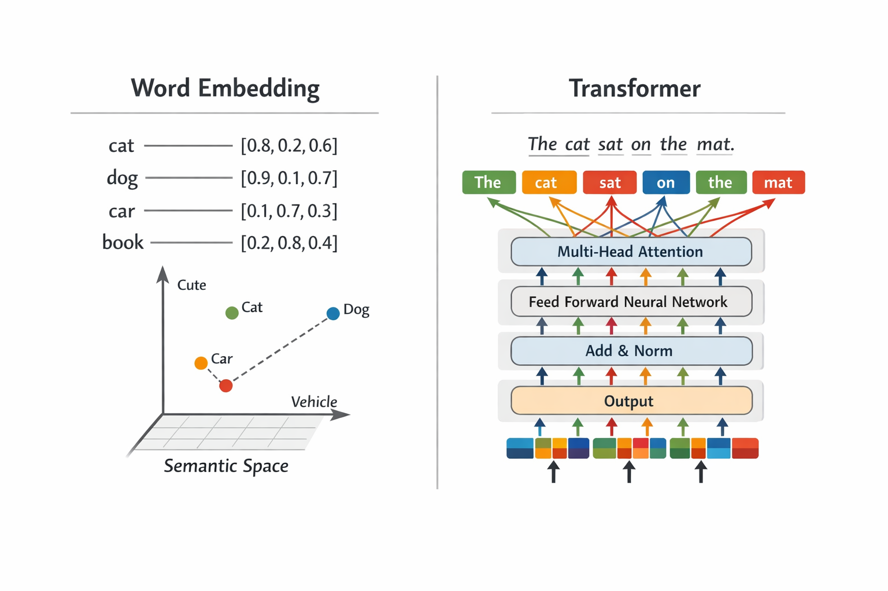

# NLP Lecture 2026 — Traitement du Langage Naturel



Lecture notes and practical notebooks for the **Natural Language Processing** course taught to M2 students in the *Santé Assurance Finance* (SAF) programme at the **University of Evry Paris-Saclay**.

> **Author:** Christophe Ambroise
> **Level:** Master 2 — Data Science
> **Licence:** [CC BY-NC-SA 4.0](https://creativecommons.org/licenses/by-nc-sa/4.0/)

---

## Course overview

The course covers the full arc of NLP, from classical word representation methods to modern large language models, with an emphasis on mathematical foundations and hands-on implementation.

| # | Chapter | Topics |
|---|---------|--------|
| 1 | **Word Embeddings** | Distributional hypothesis, co-occurrence matrices, TF-IDF, PMI, LSA, LDA, Word2Vec, GloVe |
| 2 | **Embedding exercises** | Practical problems on vector spaces and similarity measures |
| 3 | **LSA & Word2Vec notebook** | SVD-based dimensionality reduction, skip-gram training, analogy tasks |
| 4 | **Transformers** | Self-attention, positional encoding, encoder/decoder architectures, BERT, GPT, fine-tuning (SFT, RLHF) |
| 5 | **Transformer exercises** | Conceptual questions on attention, masking, and training objectives |
| 6 | **GPT from scratch notebook** | Character-level GPT implementation in PyTorch following Karpathy's nanoGPT |
| 7 | **Transformers in Practice** | Downstream tasks: text classification, QA, seq2seq, generation; fine-tuning regimes |
| 8 | **BERT exercises** | Fine-tuning BERT for sentiment analysis; feature extraction vs. full fine-tuning |
| 9 | **BERT sentiment notebook** | Fine-tune BERT on SST-2; frozen vs. fine-tuned embeddings, error analysis, attention visualisation |

---

## Repository structure

```
.
├── index.qmd                        # Course landing page
├── chapters/
│   ├── word-embedding.qmd           # Chapter 1 — Classical word embeddings
│   ├── embedding-exercise.qmd       # Chapter 2 — Embedding exercises
│   ├── transformers.qmd             # Chapter 4 — Transformer architecture
│   ├── transformers-exercice.qmd    # Chapter 5 — Transformer exercises
│   ├── transformers-applications.qmd # Chapter 7 — Transformers in practice
│   └── bert-sentiment-exercice.qmd  # Chapter 8 — BERT sentiment exercises
├── TP/
│   ├── lsa_word2vec.ipynb           # Practical 1 — LSA & Word2Vec (Chapter 3)
│   ├── gpt_dev.ipynb                # Practical 2 — GPT from scratch (Chapter 6)
│   ├── bert_sentiment.ipynb         # Practical 3 — BERT sentiment analysis (Chapter 9)
│   └── input.txt                    # Tiny Shakespeare dataset
├── notes/
│   └── FAQ.qmd                      # Reference sheet: BERT, RoBERTa, GPT family…
├── slides/
│   └── transformers-slides.html     # RevealJS slides for the transformers chapter
├── images/                          # Diagrams and figures
├── documents/                       # Reference textbook (Jurafsky & Martin)
├── _quarto.yml                      # Quarto book configuration
└── _book/                           # Rendered output (HTML + PDF)
```

---

## Learning objectives

By the end of the course, students will be able to:

- Explain the three paradigms of language modelling (symbolic, statistical, neural) and their trade-offs
- Build and manipulate word vector spaces (co-occurrence matrices, TF-IDF, PMI)
- Apply SVD-based dimensionality reduction (LSA) and topic modelling (LDA)
- Train and use Word2Vec embeddings for similarity and analogy tasks
- Describe the self-attention mechanism and the Transformer architecture mathematically
- Distinguish encoder-only (BERT), decoder-only (GPT), and encoder-decoder models
- Implement a character-level GPT from scratch in PyTorch
- Apply pre-trained Transformer models (BERT) to downstream NLP tasks via fine-tuning
- Compare feature-extraction and full fine-tuning regimes and interpret attention patterns

---

## Practical notebooks

### `TP/lsa_word2vec.ipynb`
Hands-on exploration of classical embeddings:
- Building a term–document co-occurrence matrix
- Applying SVD for LSA and visualising the latent semantic space
- Training a skip-gram Word2Vec model and exploring word analogies

### `TP/gpt_dev.ipynb`
Full GPT implementation following Andrej Karpathy's *"Let's build GPT"* lecture:
- Character-level tokeniser on the Tiny Shakespeare dataset
- Bigram language model → multi-head self-attention → full GPT block
- Training loop, loss curves, and text generation in PyTorch

### `TP/bert_sentiment.ipynb`
Fine-tuning BERT for binary sentiment analysis on the SST-2 dataset:
- WordPiece tokenisation and `[CLS]` embedding extraction
- **Regime 1 — Feature extraction:** frozen BERT + logistic regression classifier
- **Regime 2 — Full fine-tuning:** joint training with the HuggingFace `Trainer` API
- PCA visualisation of embeddings before/after fine-tuning, error analysis, custom inference
- Attention weight visualisation (layer 11, all heads)

**Additional dependencies:** `transformers`, `datasets`, `evaluate`, `accelerate`, `scikit-learn`

---

## Building the book

The book is built with [Quarto](https://quarto.org/) and produces both HTML and PDF outputs.

```bash
# Render HTML + PDF
quarto render

# Preview with live reload
quarto preview

# Render a single chapter
quarto render chapters/transformers.qmd
```

Output is written to `_book/`. Code execution results are cached via `freeze: auto` — delete `.quarto/` to force re-execution.

**Dependencies:** Python with `torch`, `numpy`, `matplotlib`, `transformers`, `datasets`, `evaluate`, `accelerate`, `scikit-learn`.

### Slides

```bash
# Render the transformers slides (RevealJS)
quarto render slides/transformers-slides.qmd --to revealjs

# Render the word embeddings slides (RevealJS)
quarto render slides/word-embedding-slides.qmd --to revealjs
```

Output: `slides/transformers-slides.html`, `slides/word-embedding-slides.html`.

---

## Reference material

- Jurafsky & Martin, *Speech and Language Processing* (3rd ed. draft) — in `documents/`
- Vaswani et al. (2017), [Attention Is All You Need](https://arxiv.org/abs/1706.03762)
- Karpathy, [nanoGPT](https://github.com/karpathy/nanoGPT) and [video lecture](https://www.youtube.com/watch?v=kCc8FmEb1nY)
- Devlin et al. (2019), [BERT: Pre-training of Deep Bidirectional Transformers](https://arxiv.org/abs/1810.04805)
- HuggingFace, [Transformers documentation](https://huggingface.co/docs/transformers)
- `notes/FAQ.qmd` — concise reference sheet for BERT, RoBERTa, GPT-2/3, T5, and other models covered in the course
