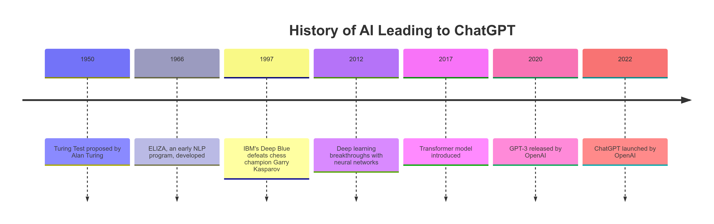
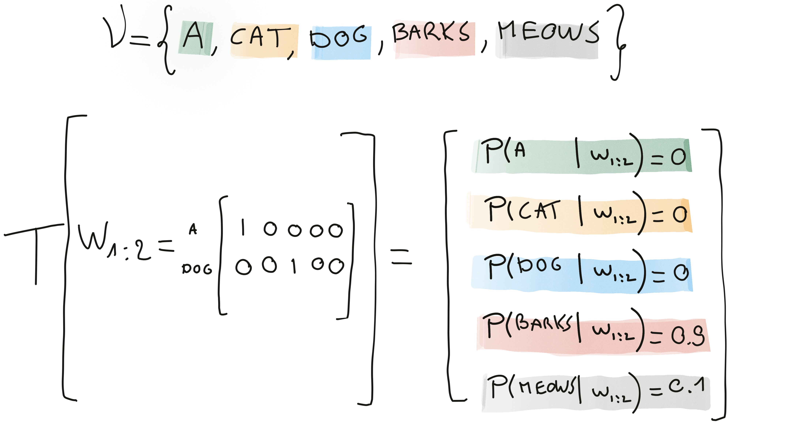
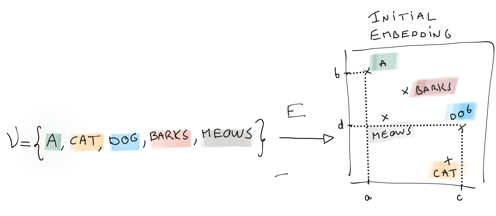
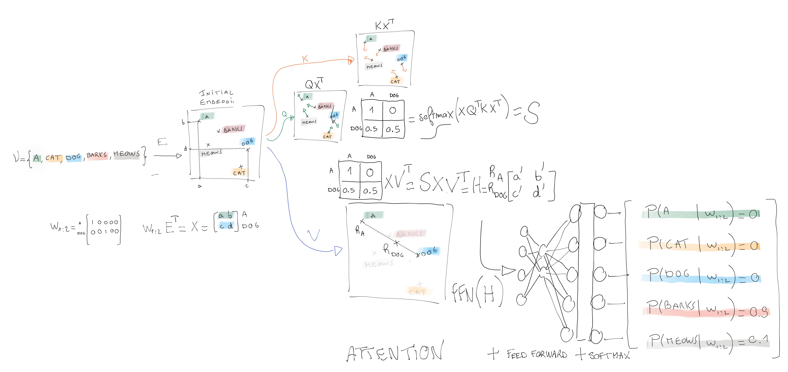
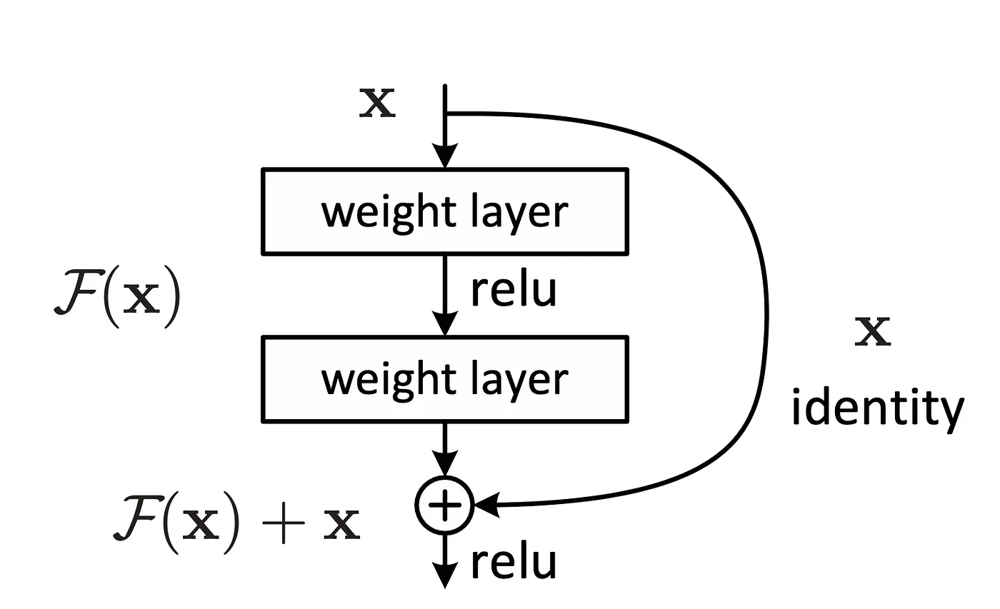

# Transformers

## Outline

-   How transformers are defined mathematically and what training objectives they optimise
-   How **self-attention** produces contextual representations from raw embeddings
-   The role of positional encoding, FFN, skip connections, layer normalisation, and dropout
-   The difference between **encoder-only**, **decoder-only**, and **encoder-decoder** architectures
-   How modern LLMs are fine-tuned (SFT, RLHF) and how text is generated at inference time

---

## From Turing to ChatGPT

-   Deep learning architecture based on **attention mechanisms**
-   Weight the importance of different tokens in a sequence to **model long-range dependencies efficiently**

## What is a Transformer?

::::: columns
::: {.column width="35%"}
A classical transformer is a function $$
T(w_{1:n}) = \begin{bmatrix} p_1 \\
\vdots \\
p_{|V|}\end{bmatrix}
$$
:::

::: {.column width="65%"}
{width="400px"}
:::
:::::

-   $\mathcal V$ is a finite set (vocabulary) (Open AI uses 50,000 token as vocabulary)
-   $w_{1:n}$ be a sequence of token, where each $w_i \in \mathcal V$ (In practice context varies from 1 to n, the blocksize)
-   $p_j$ is the probability of $w_{(j)}$ the jth token in $\mathcal V$

### Remarks

-   $w_{1:n}$ is usually coded a matrix of one-hot vectors with $w_{1:n} \in \mathbb{R}^{n \times |V|}$.
-   For classical chatbot $p_j = P(w_{n+1}  = w_{(j)} | w_{1:n})$ where $w_{(j)}$ is the jthe element of $\mathcal V$.

## Optimized criteria

Transformers typically optimize different criteria depending on the task they are trained on.

### Causal Language Modeling (CLM) / Autoregressive Loss

-   **Used in:** GPT models
-   **Objective:** Predict the next token given the previous tokens

The training set is a set of sequences $(s_j)$ of $n$ tokens $s_j=(w_1^j, w_2^j, \dots, w_n^j)$:

$$
L_{CLM} = -  \sum_j\sum_{t=1}^n \sum_{c\in V} I\!\!I_{w_t^j=c}\log P(w_t^j=c | w_{1:t-1}^j)
$$ where $w_{1:t-1}^j$ denotes the tokens preceding position $t$ in the sequence $j$

The criterion is a kind of pseudo log-likelihood.

If nothing is learned each token has the same probability of appearing: the largest possible value of the criterion is $$
-\log\frac{1}{|V|}
$$

## Masked Language Modeling (MLM)

-   **Used in:** BERT models
-   **Objective:** Predict randomly masked tokens in a sentence.

Let $M_j \subset \{1, \dots, n\}$ be the set of masked positions in the sequence $(s_j)$:

$$
L_{MLM} = -  \sum_j \sum_{t \in M_j} \sum_{c\in V} I\!\!I_{w_t^j=c} \log P(w_t^j=c | w^j_{(1:n)\backslash M})
$$

## Conditional Language Modeling / Translation Loss

-   **Used in:** T5, BART
-   **Objective:** Predict an output sequence given an input sequence (e.g., translation, summarization).

Given input sequence $w^j = (w^j_1, \dots, w^j_n)$ and output sequence $v^j = (v^j_1, \dots, v^j_m)$:

$$
L_{Seq2Seq} = - \sum_j \sum_{t=1}^m \sum_{c\in V} I\!\!I_{v_t^j=c} \log P(v_t^j=c | v^j_{1:t-1}, w^j_{1:n})
$$

### Other losses

Transformers exact objective functions depends on type of considered problems

## Initial embedding

-   The token are first embedded in a $d$ dimensional space (see previous topic)
-   the representation $x_i= E w_i$ is independent of context.
-   Let $X= x_{1:n} = w_{1:n} E^\top \in \mathbb{R}^{n \times d}$.

## A minimal self-attention architecture for decoder

**Attention is a communication mecanism** between the tokens of a sequence.

Self attention proposes a contextual representation $h_i$ of $x_i$ as a linear combination the sequence: $$
h_i =V . \sum_{j=1}^n \alpha_{ij}  x_j
$$

-   $h_i$ aggregates the past between query (current postion i) and key (other past position j)
    -   $\sum_j \alpha_{ij}=1$
-   In decoder the future cannot communicate with the past
    -   $\forall j>i, \alpha_{ij}=0$
-   the structure of the attention matrix is thus lower triangular in classical GPT decoder,
-   it is not necessary to have a triangular attention matrix (i.e. sentiment analysis)
-   $V$ is learned matrix of parameters and can be seen a projection matrix modifying the embedding of the linear combination of sequence tokens. Let consider V as a square matrix $d\times d$.

## Attention and matrix notation

-   $\alpha_{ij}=\text{softmax}(x_i^T Q^T K x_j) = \frac{exp(x_i^T Q^T K x_j)}{\sum_{j=1}^n \exp{\left(  x_i^T Q^T K x_j \right)}}$, where
    -   Q is a matrix that modifies the embedding of the token we are looking for. Let consider Q as a square matrix $d\times d$.
        -   K is a matrix that modifies the embedding of the word we are comparing against. Let consider K as a square matrix $d\times d$.

### Matrix notation

$$
 H=\begin{bmatrix}
 h_1^T \\
 \vdots \\
 h_n^T
 \end{bmatrix} = \text{Attention(Q,K,V,X)}= \text{softmax}\!\left(\frac{X Q^T K X^T}{\sqrt{d_k}}\right) X V^T
$$

### Remark

In the original paper ("Attention is all you need", 2017) the notation is different and notes:

-   $X Q^T$ as $Q$,
-   $X K^T$ as $K$, and
-   $X V^T$ as $V$

The $1/\sqrt{d_k}$ scaling prevents the dot products from growing large in magnitude (which would push softmax into regions with very small gradients).

## Illustration of self-Attention

## Interpretation of Q, K, V

-   The query is modified version of an initial embedding $q_i = Q x_i$\
-   The Key is modified version of an initial embedding $k_i = K x_i$
-   Value is modified version of an initial embedding $v_i = V x_i$, which should include contextual information since it is a transformation of a linear combination of the context tokens...

| Attention Concept | Sometimes Similar to |
|----------------------------------|--------------------------------------|
| Query | Target (What to focus on) |
| Key | Context (What to compare against, the source of information) |
| Value | Contextual embedding |

## Important details

The original paper introduces many add-ons, which much improve the transformers performances:

-   **Positional encoding** for introducing the notion of order in the sequence
-   FFN: **Feed Forward Neural layer**.
    -   As the attention is a linear operation composed with a softmax, a Feed Forward Neural layer is added for making the function more flexible
-   **Multi-blocks**: In the spirit of Deep learning blocks of attention and FNN are repeated...
-   **Dropout layers** are used for preventing overfitting (from "Dropout a simple way to prevent NN from overfitting" Hinton)
-   Simple trick of **Skip connection** for stabilizing the gradient (from "Deep learning residuals for image recognition")
    -   The deep learning structure tends to cause problems with gradient computation (vanishing or exploding gradient)
-   In order to make tokens comparable, they are all **normalized** at the output of each blocks:
    -   The classical z-transformed is applied (with Bayesian correction)
-   **Multi-head attention**: computes multiple attention functions (heads) in parallel

## Layer Normalization

After each sub-layer (attention or FFN), a **Layer Normalization** is applied:

$$\text{LayerNorm}(x) = \gamma \odot \frac{x - \mu}{\sigma + \epsilon} + \beta$$

where $\mu$ and $\sigma$ are the mean and standard deviation computed **over the feature dimension** (not the batch), and $\gamma$, $\beta$ are learned scale and shift parameters.

**Why not Batch Norm?**
In NLP, sequences have variable lengths and mini-batches are small; statistics computed over the batch are unreliable. LayerNorm computes statistics per token, making it robust to sequence length.

### Place in the architecture

In the original paper the order is: sub-layer → Add (skip) → Norm.
Most modern implementations use *Pre-LN*: Norm → sub-layer → Add, which stabilizes training of very deep networks.

## Dropout in Transformers

Dropout (Hinton et al., 2014) randomly zeroes activations during training:

$$\text{Dropout}(x)_i = \begin{cases} 0 & \text{with probability } p \\ \frac{x_i}{1-p} & \text{otherwise} \end{cases}$$

In transformers, dropout is applied:

1. **To attention weights** $A$ before computing the weighted sum of values.
2. **To the output of each sub-layer** before the residual addition.

Typical rates: $p \in \{0.1, 0.2\}$.
Dropout is **disabled at inference time**.

## Positional encoding

-   Attention do not consider order of tokens !
-   Incorporating information about the order of tokens is achieved by adding positional encodings to the input embeddings

The original transformer implementation uses:

-   even indices: $$
    PE_{\text{pos}, 2i} = \sin\left(\frac{\text{pos}}{10000^{\frac{2i}{d}}}\right)
    $$
-   odd indices: $$
    PE_{\text{pos}, 2i+1} = \cos\left(\frac{\text{pos}}{10000^{\frac{2i}{d}}}\right)
    $$

It ensures that each position is assigned a unique encoding

## Feed Forward Neural Network

-   **Attention mechanism operates linearly** to capture dependencies between tokens in a sequence
-   Non-linearity enhance the model’s expressive power

### Structure of the FFN:

Each FFN consists of two linear transformations with a non-linear activation function in between:

1.  First Linear Transformation:  embedding of the input from the model’s dimensionality $d$ to a higher-dimensional space
2.  Activation Function: A non-linear function is applied to introduce non-linearity
3.  Second Linear Transformation: projects the output back to the original dimensionality

$$
\text{FFN}(x) = W_2 \cdot \text{ReLU}(W_1 \cdot x + b_1) + b_2
$$

where $W_1$ and $W_2$ are weight matrices, and $b_1$ and $b_2$ are bias vectors.

## Skip connection (original paper “Deep Residual Learning for Image Recognition” 2015 by He et al.)

{ width=50% }

Skip connections  address the vanishing (and exploding) gradient problems

- Consider a neural network layer with an input $x$ and a desired underlying function $H(x)$.

- Incorporating a skip connection, the layer is restructured to model a residual $F(x)= H(x)- x$. Thus, the output  of this layer becomes:

$$
y = F(x) + x
$$

### Benefits:

- Enhanced Gradient Flow
- Faster convergence and  higher accuracy

## Multi-head attention

-   Multi-Head Attention captures various aspects of the data.
-   The mechanism computes multiple attention functions (heads) in parallel.
-   Each head operates on linearly projected versions of the queries, keys, and values

Each head $k$ computes the attention scores $$
\text{Attention}(Q_k, K_k, V_k) = \text{softmax}\left(\frac{XQ_k^T K_kX}{\sqrt{d_k}}\right)X V_k^T
$$ where $d_k$ is the dimension of the key vectors

### Concatenation

The outputs of all heads are concatenated and projected through a final linear layer: $$
\text{MultiHead}(Q, K, V) = \text{Concat}(\text{head}_1, \ldots, \text{head}_h) P
$$ The multi head matrix is $d \times d$, where - $h$ is the number of head, - $d_k= d/h$ the size of the projection space of head k - $P$ is a projection matrix combining the heads.

### Benefits

-   Diverse Representations: Each head can capture different features or relationships within the data, enabling the model to understand various aspects of the input (grammar, style, "meaning"...).
    -   Parallel Processing: Multiple heads allow the model to process different parts of the sequence simultaneously, improving efficiency.
    -   Enhanced Capacity: By attending to information from different subspaces, the model can capture complex patterns and dependencies.

## Complexity of Self-Attention

| Operation | Time complexity | Space complexity |
|---|---|---|
| Self-attention | $O(n^2 d)$ | $O(n^2)$ |
| FFN | $O(n d^2)$ | $O(d^2)$ |

Self-attention is **quadratic in sequence length** $n$.
For long documents ($n > 4096$) this becomes prohibitive — motivation for variants such as:

-   **Sparse attention** (Longformer, BigBird)
-   **Linear attention** approximations
-   **Flash Attention** (IO-aware exact attention, Dao et al. 2022)

Modern LLMs also use a **KV-cache** at inference: keys and values from past tokens are cached so each new token only attends to stored K/V pairs, reducing per-step cost from $O(n^2)$ to $O(n)$.

## Three Transformer Families

| Architecture | Attention mask | Representative models | Typical use |
|---|---|---|---|
| **Encoder-only** | Bidirectional (full) | BERT, RoBERTa | Classification, NER, Q&A |
| **Decoder-only** | Causal (triangular) | GPT-2/3/4, LLaMA | Text generation, chat |
| **Encoder-Decoder** | Enc: full; Dec: causal + cross-attn | T5, BART, mT5 | Translation, summarization |

## Tokenization

Transformers do not operate on raw characters or words but on **subword tokens**.

### Byte-Pair Encoding (BPE)

1. Start with a character-level vocabulary.
2. Iteratively merge the most frequent adjacent pair of tokens.
3. Repeat until the vocabulary reaches size $|V|$.

**Example:** `"lower"` → `["low", "er"]`; `"lowest"` → `["low", "est"]`

GPT-2/3/4 use BPE with $|V| \approx 50{,}000$.
BERT uses **WordPiece** (similar but merges maximise likelihood rather than frequency).

### Why subwords?

-   Handles unknown words (out of vocabulary (OOV)) via decomposition.
-   Balances vocabulary size vs. sequence length.
-   Works across languages without language-specific tokenisers.

## Additional steps — Supervised Fine-Tuning (SFT) + Reinforcement Learning from Human Feedback (RLHF)

After a pretraining step that resembles closely to a decoder...

A raw CLM model **continues text**, it does not follow instructions.

Two fine-tuning stages are needed:
 
**1. Supervised Fine-Tuning (SFT)**
Train on (instruction, response) pairs to shift the distribution
toward helpful answers.
 
**2. Reinforcement Learning from Human Feedback (RLHF)**
A reward model scores responses; the LLM is updated via Proximal Policy Optimization (PPO) or Direct Preference Optimization (DPO) to maximise human preference.
 
## PPO — Proximal Policy Optimization
 
Schulman et al. (2017) — used by OpenAI for **InstructGPT / ChatGPT**.
 
The LLM is treated as a **policy** $\pi_\theta$ updated to maximise expected reward:
 
$$\mathcal{L}_{\text{PPO}} = \mathbb{E}\!\left[ r_\phi(x, y) - \beta \, \mathrm{KL}\!\left(\pi_\theta \| \pi_{\text{ref}}\right) \right]$$
 
- $r_\phi(x, y)$ — reward model score for response $y$ given prompt $x$
- $\mathrm{KL}(\pi_\theta \| \pi_{\text{ref}})$ — prevents the policy from drifting too far from the reference model
- $\beta$ — controls the strength of the KL penalty

## Generating Text from a Decoder

Given $P(w_{n+1} \mid w_{1:n})$, how do we select the next token?

### Greedy decoding
Always pick $\arg\max_{w} P(w \mid w_{1:n})$.
Fast but repetitive — the model tends to loop.

### Beam search
Maintain $B$ candidate sequences, expand each, keep the $B$ highest probability continuations.
Better quality but still deterministic.

### Sampling with temperature
$$P_T(w) \propto P(w)^{1/T}$$

-   $T \to 0$: greedy (deterministic)
-   $T = 1$: original distribution
-   $T > 1$: flatter, more random

### Top-$k$ and Top-$p$ (nucleus) sampling
Restrict sampling to the $k$ most probable tokens, or to the smallest set whose cumulative probability exceeds $p$.
In practice, `top_p=0.9, temperature=0.8` is a common default for creative tasks.

## From Theory to Code

The TP notebook `gpt_dev.ipynb` implements every concept in this chapter:

| Concept | Location in notebook |
|---|---|
| Bigram baseline | Section 1 |
| Token + positional embedding | Section 3 |
| Self-attention head | `Head` class |
| Multi-head attention | `MultiHeadAttention` class |
| FFN + skip + LayerNorm | `Block` class |
| Full GPT training loop | Section 5 |

The implementation follows Karpathy's *nanoGPT* and trains on the Tiny Shakespeare dataset (`input.txt`).

