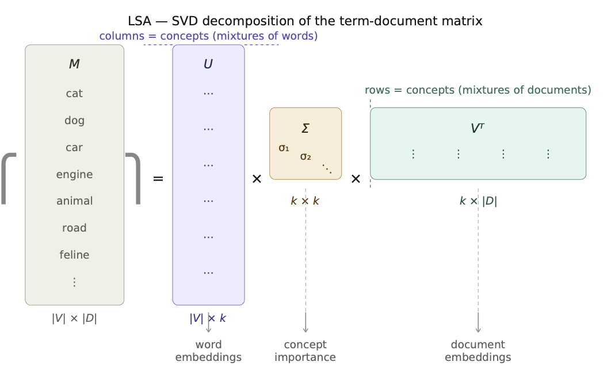
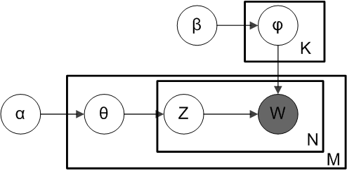

# Word Embeddings

## Different approaches of language modeling

Three paradigms have shaped how machines process and understand language:

### Symbolic (rule-based)

Hand-crafted grammars, lexicons, and inference rules encode linguistic knowledge explicitly.

- **How it works**: linguists write rules (*"a noun phrase = determiner + adjective + noun"*); parsers apply them mechanically.
- **Strengths**: interpretable, deterministic, works well on narrow well-defined tasks.
- **Weaknesses**: brittle — rules break on unseen text; enormous engineering effort; poor coverage of natural language variability.
- **Examples**: ELIZA (1966), WordNet, classic machine translation systems (SYSTRAN).

### Statistical (data-driven)

Learn probability distributions over words and sequences from large corpora; no hand-crafted rules.

- **How it works**: count co-occurrences, estimate $n$-gram probabilities, or learn latent factors (TF-IDF, PMI, LSA, LDA).
- **Strengths**: robust to variation, scales with data, language-agnostic.
- **Weaknesses**: requires large corpora; bag-of-words models lose word order; sparse representations struggle with rare words.
- **Examples**: $n$-gram language models, TF-IDF retrieval, LSA, LDA.

### Neural (deep learning)

Learn dense, distributed representations end-to-end from raw text using differentiable architectures.

- **How it works**: train neural networks (feedforward, RNN, Transformer) on prediction tasks; representations emerge as by-products of training.
- **Strengths**: capture long-range dependencies, share statistical strength across similar words (dense embeddings), generalise well.
- **Weaknesses**: data- and compute-hungry; less interpretable; static embeddings conflate word senses.
- **Examples**: Word2Vec, GloVe, ELMo, BERT, GPT.

::: {.callout-note}
The three paradigms are not mutually exclusive. Modern systems often combine them
:::

## History of Word Embeddings

- 1950s: Distributional hypothesis (Harris 1954; Firth 1957)

::: {.callout-note}
**Distributional models** (also called *distributional semantic models*) represent the meaning of a word as a function of the contexts in which it appears. They are grounded in the **distributional hypothesis** (Harris 1954; Firth 1957): *"a word is characterized by the company it keeps"* — words that occur in similar contexts tend to be related in meanings. These models derive meaning automatically from large corpora by counting co-occurrences.
:::

- 1990: Latent Semantic Analysis (LSA) — Deerwester et al. (1990)
- 2003: Latent Dirichlet Allocation (LDA) — Blei et al. (2003)
- 2013: Word2Vec — Mikolov et al. (2013)
- 2014: GloVe — Pennington et al. (2014)

## From Words to Vectors

Vector or distributional models of meaning are generally based on a co-occurrence matrix

### Two common co-occurrence matrix

-   the word-document matrix
-   the word-word matrix.

### Practical construction

- **tokenization** and **lemmatization** are common preprocessing steps to reduce sparsity and focus on content words. 

  - a token is a unit of text (word, subword, character) that serves as the basic building block for vector representations.	
  - Lemmatization reduces inflected forms to a common base form (lemma).
	  - For example, "run", "runs", "running" would all be lemmatized to "run".
  - tokens like "the", "is", "and" are often removed as stop words.

- **The choice of context** (document, sentence, window) also affects the resulting vectors.

:::{.callout-note}
In the document we will use `term`or `word` to refer to meaning units, and `context` to refer to the column labels. The context could be a document, a sentence, or a window of words around the **target word**.
:::

## Word-document matrix

In a Word-document matrix, each row represents a word in the vocabulary and each column represents a document from some collection of documents.

Corpus of 5 short sentences about NLP (used as a running example throughout this chapter):

| | S1 | S2 | S3 | S4 | S5 |
|---|:---:|:---:|:---:|:---:|:---:|
| **word** | 1 | 0 | 0 | 1 | 0 |
| **embeddings** | 1 | 0 | 0 | 0 | 0 |
| **vectors** | 0 | 0 | 0 | 1 | 0 |
| **neural** | 0 | 1 | 0 | 0 | 1 |
| **language** | 0 | 0 | 1 | 0 | 1 |
| **models** | 0 | 0 | 1 | 0 | 1 |
| **context** | 0 | 0 | 0 | 1 | 0 |
| **meaning** | 1 | 0 | 0 | 0 | 0 |

: Term-document matrix — S1: *"word embeddings represent meaning"* · S2: *"deep neural networks learn representations"* · S3: *"language models process text"* · S4: *"word vectors capture context"* · S5: *"neural language models predict"*

## Word-Word matrix

In the Word-context matrix the columns are labeled by words rather than documents.

-   each cell records the number of times the row (target) word and the column (context) word co-occur in some context in some training corpus.

### Context

-   a context could be the document, in which case the cell represents the number of times the two words appear in the same document.
-   smaller contexts are common: generally a window around the word

Word-word matrix for the same corpus (window $L=1$, symmetric counts):

| | word | embeddings | vectors | represent | meaning | capture | context |
|---|:---:|:---:|:---:|:---:|:---:|:---:|:---:|
| **word** | — | 1 | 1 | 0 | 0 | 0 | 0 |
| **embeddings** | 1 | — | 0 | 1 | 0 | 0 | 0 |
| **vectors** | 1 | 0 | — | 0 | 0 | 1 | 0 |
| **represent** | 0 | 1 | 0 | — | 1 | 0 | 0 |
| **meaning** | 0 | 0 | 0 | 1 | — | 0 | 0 |
| **capture** | 0 | 0 | 1 | 0 | 0 | — | 1 |
| **context** | 0 | 0 | 0 | 0 | 0 | 1 | — |

: Word-word co-occurrence matrix (window $L=1$)

::: {.callout-note}
"embeddings" and "vectors" share the same context word ("word") → identical column profiles → cosine similarity = 1, even though they never appear in the same sentence.
:::

## Cosine for measuring similarity

The cosine similarity metric (or empirical correlation) between two word vectors $\boldsymbol v$ and $\boldsymbol w$ (lines of a word-document or word-word matrix)

$$
\cos(\boldsymbol v,\boldsymbol w) = \frac{\boldsymbol v^T \boldsymbol w}{\|\boldsymbol v\|  \|\boldsymbol w\|}
$$

## TF-IDF: Weigthing terms in the vector

### Term frequency (TF)

-   Raw frequency $TF_{t,d} = count(t,d)$ is very skewed and not very discriminative.
-   Usually squashed by using the $log10$: a word appearing 100 times in a document doesn't make that word 100 times more relevant 

$$
    \text{TF}_{t,d} =  \log_{10}\left(count(t,d)+1\right)
$$

### Inverse document frequency

The second factor in tf-idf is used to give a higher weight to words that occur only in a few documents. 

$$
IDF_t = \log_{10}\left(\frac{N}{\text{DF}_t}\right)   
$$ 

where $N$ is the total number of documents, and $DF_t$ is the number of documents in which term $t$ occurs.

## TF-IDF: Weigthing terms in the vector

The TF-IDF weighted value $w_{t,d}$ for term $t$ in document $d$ thus combines term frequency $TF_{t,d}$ with $IDF_t$: 

$$
w_{t,d} = TF_{t,d} \times IDF_t
$$

Applied to our running corpus ($N=5$ documents):

| | S1 | S2 | S3 | S4 | S5 | idf |
|---|:---:|:---:|:---:|:---:|:---:|:---:|
| **word** | 0.12 | 0 | 0 | 0.12 | 0 | 0.40 |
| **embeddings** | **0.21** | 0 | 0 | 0 | 0 | 0.70 |
| **vectors** | 0 | 0 | 0 | **0.21** | 0 | 0.70 |
| **neural** | 0 | 0.12 | 0 | 0 | 0.12 | 0.40 |
| **language** | 0 | 0 | 0.12 | 0 | 0.12 | 0.40 |
| **models** | 0 | 0 | 0.12 | 0 | 0.12 | 0.40 |
| **context** | 0 | 0 | 0 | **0.21** | 0 | 0.70 |
| **meaning** | **0.21** | 0 | 0 | 0 | 0 | 0.70 |

: TF-IDF weighted term-document matrix — $\text{TF} = \log_{10}(1+1) = 0.30$ for all present terms (each appears once per sentence)

Words appearing in only one document ("embeddings", "vectors", "context", "meaning") receive the highest weight 0.21; words shared across two documents ("word", "neural", "language", "models") receive 0.12.

## Pointwise Mutual Information (PMI)

An alternative weighting function to tf-idf, PPMI (positive pointwise mutual information), is used for **term(target)-term(context)-matrices**.
 
 - Target word, word we focus on.
 - Context words surrounding the target word

The pointwise mutual information between a **target word** $w$ and a **context word** $c$ (Church and Hanks 1989, Church and Hanks 1990) is defined as: 

$$
PMI(w, c) = \log_2 \frac{P(w, c)}{ P(w)P(c)}
$$

## Positive PMI (called PPMI)

Negative PMI values (which imply things are co-occurring less often than we would expect by chance) tend to be unreliable unless our corpora are enormous.

### Positive PMI

replaces all negative PMI values with zero (Church and Hanks 1989, Dagan et al. 1993, Niwa and Nitta 1994)

$$
PPMI(w, c) = \max(\log_2 \frac{P(w, c)}{P(w)P(c)} , 0) 
$$

::: {.callout-warning}
**What if $P(w, c) = 0$?**

When a pair $(w, c)$ is never observed in the corpus:
$$P(w, c) = 0 \implies PMI(w, c) = \log_2 \frac{0}{P(w)P(c)} = -\infty$$

PPMI neutralises this *on the surface* — $\max(0, -\infty) = 0$ — but this hides an important ambiguity: after PPMI, a score of 0 can mean two very different things:

- the pair is **unobserved** (no information)
- the pair is **independent** (PMI exactly zero)

**Common solutions**

- **Smoothing**: add a small $\epsilon > 0$ to all counts before estimating probabilities, avoiding zeros at the cost of a slight bias.

- **Sparse storage**: store only non-zero entries — zeros are never computed. This is the most pragmatic and widespread approach in practice.
:::

## Example of PPMI weighting

Applied to our word-word matrix (16 context pairs total, window $L=1$):

$$
\text{PMI}(\text{embeddings}, \text{word}) = \log_2 \frac{P(\text{emb},\text{word})}{P(\text{emb}) \cdot P(\text{word})} = \log_2 \frac{1/16}{(2/16)(2/16)} = \log_2 4 = 2.0
$$

| | word | embeddings | vectors | represent | meaning |
|---|:---:|:---:|:---:|:---:|:---:|
| **word** | — | **2.0** | **2.0** | 0 | 0 |
| **embeddings** | **2.0** | — | 0 | **2.0** | 0 |
| **vectors** | **2.0** | 0 | — | 0 | 0 |
| **represent** | 0 | **2.0** | 0 | — | **2.0** |
| **meaning** | 0 | 0 | 0 | **2.0** | — |

: PPMI matrix — all other co-occurrences have PMI $\leq 0$, set to 0 by PPMI

## Applications of the TF-IDF or PPMI vector models

### Principle

-   Computing two documents (or word) similarity after transformation.
-   Given two documents $d_1$ and $d_2$, the similarity is $\cos(d_1,d_2)$.

### Applications

-   **Documents** : information retrieval, plagiarism detection, news recommender systems, and even for digital humanities tasks like comparing different versions of a text to see which are similar to each other.

-   **Words** : finding word paraphrases, tracking changes in word meaning, or automatically discovering meanings of words in different corpora.

## Latent Semantic Analysis (LSA)

### Goal and assumptions

-   extracting and representing the underlying meaning of words in a corpus of texts.
-   words that occur in similar contexts have similar meanings.

### Principle

LSA uses singular value decomposition (SVD) to identify latent, or hidden, patterns in word co-occurrence data.

## Latent Semantic Analysis

LSA uses SVD on the matrix of word-document matrix to identify the latent concepts (contexts, topics, ...) that underlie the relationships between words in the corpus: $W = U S V^T$ with classical low rank approximation $U_k S_k V_k^T$

## Latent Semantic Analysis

- The values on the main diagonal of $S_k$ indicate the 'importance' of each of the k main 'latent concepts' (or factors).
- For each of the  document, the corresponding row of $U_k$ allows us to see which concepts are present and with what weights.
- For each of the  concept, the associated column of $V_k$  indicates which terms form the concept (and with what weights).

Calculating the similarity between a term and a document involves choosing: 

- the row $\mathbf{u}$ corresponding to the document in the matrix $\mathbf{U}_k$, 
- the row $\mathbf{v}$ corresponding to the term in the matrix $\mathbf{V}_k$, 
- and then computing the product $\mathbf{u}\mathbf{S}_k\mathbf{v}^T$. 

To determine the similarity of a term to each of the documents
$$
\mathbf{U}_k \mathbf{S}_k \mathbf{v}^T 
$$
Conversely, we can determine the similarities between a document $\mathbf{u}$ and all the terms 
through 
$$
\mathbf{u} \mathbf{S}_k \mathbf{V}_k^T
$$

## Latent Dirichlet Allocation (LDA)

### History

In the context of population genetics, LDA was proposed by J. K. Pritchard, M. Stephens and P. Donnelly in 2000.

LDA was applied in machine learning by David Blei, Andrew Ng and Michael I. Jordan in 2003.

### Principle 

Latent Dirichlet Allocation (LDA) is a probabilistic generative model that assumes that

-   each document  is generated by a mixture of latent topics
-   each topic is generated by a mixture of words from the vocabulary.

Documents are represented as random mixtures over latent topics, where each topic is characterized by a distribution over all the words. 

## LDA Generative process

For a corpus $D$ consisting of $M$ documents

1.  Choose topic parameter vector for document $i$: 
$\theta_i \sim \operatorname{Dir}(\alpha)$, where $i \in \{ 1,\dots,M \}$ and $\mathrm{Dir}(\alpha)$ is a Dirichlet distribution with a symmetric parameter $\alpha$ which typically is sparse ($\alpha$).

2.  Choose the word parameters vector of topic $k$: 
$\varphi_k \sim \operatorname{Dir}(\beta)$, where $k \in \{ 1,\dots,K \}$ and $\beta$ typically is sparse

3.  For each of the word positions $i,j$, where $i \in \{ 1,\dots,M \}$, and 
$j \in \{ 1,\dots,N_i\}$

a.  Choose a topic $z_{i,j} \sim\operatorname{Cat}(\theta_i).$
b.  Choose a word $w_{i,j} \sim\operatorname{Cat}( \varphi_{z_{i,j}}).$

## Latent Dirichlet Allocation (LDA) in summary

\begin{align}
\boldsymbol\varphi_{k=1 \dots K} &\sim \operatorname{Dirichlet}_V(\boldsymbol\beta) \\
\boldsymbol\theta_{d=1 \dots M} &\sim \operatorname{Dirichlet}_K(\boldsymbol\alpha) \\
z_{d=1 \dots M,w=1 \dots N_d} &\sim \operatorname{Categorical}_K(\boldsymbol\theta_d) \\
w_{d=1 \dots M,w=1 \dots N_d} &\sim \operatorname{Categorical}_V(\boldsymbol\varphi_{z_{dw}})
\end{align}

$$
P(\boldsymbol{W}, \boldsymbol{Z}, \boldsymbol{\theta}, \boldsymbol{\varphi};\alpha,\beta) = \prod_{i=1}^K P(\varphi_i;\beta) \prod_{j=1}^M P(\theta_j;\alpha) \prod_{t=1}^N
P(Z_{j,t}\mid\theta_j)P(W_{j,t}\mid\varphi_{Z_{j,t}}) ,
$$

## Latent Dirichlet Allocation (LDA) estimation

Estimating the parameters could be achieved through Variationnal Bayes EM algorithm.

## Example of LDA in Action

Corpus of Three Documents

1.	"cats dogs pets love"
2. 	"dogs bark loud outside"
3.	"politics government election law"

Step 1: Identify Topics

After running LDA, it may discover two topics (dist. over words):

-	Topic 1 (Pets): {cats, dogs, pets, bark, love}
-	Topic 2 (Politics): {politics, government, election, law}

Step 2: Assign Topics to Documents

- Document 1 -> $90\%$ Topic 1, $10\%$ Topic 2
- Document 2 -> $80\%$ Topic 1, $20\%$ Topic 2
- Document 3 -> $95\%$ Topic 2, $5\%$ Topic 1

## Pro and Cons

### Advantages of LDA

- Unsupervised Learning: No labeled data needed.
- Interpretable Topics: Extracts meaningful topics from text.

### Limitations of LDA

- Fixed Number of Topics: Must specify the number of topics beforehand.
- Bag-of-Words Assumption: Ignores word order and context.
- Computationally Expensive: Requires approximation methods for inference.

### Applications of LDA

-  Topic Modeling:  Organizing large text corpora (news articles, research papers).
-  Recommendation Systems:  Suggesting articles based on topic similarity.
-  Text Classification:  Assigning labels based on topic distributions.
-   Social Media Analysis:  Identifying trending topics in posts.

## Word2vec

### Embeddings

-   more powerful word representation
-   short dense vectors: $d$ ranging from 50-1000, rather than the much larger vocabulary size $|V|$ or number of documents $D$
-   dense vectors work better in every NLP task than sparse vectors

### Skip-gram with negative sampling

-   The skip-gram algorithm is one of two algorithms in a software package called word2vec
-   The other algorithm is CBOW (continuous bag of words)

The two algorithms share the same neural architecture but differ in the direction of prediction:

**1. Skip-gram**

- *Task*: given a target word $w$, predict its surrounding context words $c$.
- *Objective*: maximise $P(c \mid w)$ for each observed context word.
- Each occurrence of a word produces multiple training signals (one per context word in the window), making skip-gram particularly effective for **rare words**.
- Slower to train: generates many predictions per word.

**2. CBOW (Continuous Bag of Words)**

- *Task*: given a bag of context words $c_1, c_2, \ldots, c_k$, predict the central word $w$.
- *Objective*: maximise $P(w \mid c_1, c_2, \ldots, c_k)$.
- Context vectors are averaged before the prediction step, which smooths out context information.
- Faster to train: one prediction per window; works better for **frequent words**.

| | Skip-gram | CBOW |
|---|---|---|
| Prediction direction | word → context | context → word |
| Training speed | Slower | Faster |
| Rare words | Better | Worse |
| Frequent words | Good | Better |

## Embedding derived from classification

### Data : words and their context (neighboring words ($\pm L$)

word embeddings **represent** meaning

c1 c2 **w** c3 

### Classification task

Given a tuple $(\boldsymbol w,\boldsymbol c) \in \mathbb R^d\times R^d$ of a target word $\boldsymbol w$ paired with a candidate context word $\boldsymbol c$ (for example (apricot, jam), or perhaps (apricot, aardvark)) return the probability that $c$ is a real context word (true for jam, false for aardvark): $$
P(y_{wc}=1 |\boldsymbol w, \boldsymbol c) = 1-P( y_{wc}=0 |\boldsymbol w, \boldsymbol c)  
$$

### Similarity

we rely on the intuition that two vectors are similar if they have a high dot product (cosine is just a normalized dot product):

$$
Similarity(\boldsymbol w,\boldsymbol c) = \boldsymbol c^T \boldsymbol w
$$

## From dot product to logistic regression

### Logit

$$
P(y_{wc}=1 |\boldsymbol w, \boldsymbol c) = \frac{1}{1+\exp(-\boldsymbol c^T \boldsymbol w)}
$$

### Criterion

The criterion is a kind of likelihood including positive examples (observed association) and negative examples (non observed associations). In fact skip-gram with negative sampling (SGNS) uses more negative examples than positive examples (with the ratio between them set by a parameter $k$).

$$
L = \sum_{ \boldsymbol w, \boldsymbol c : y_{wc} = 1} \log P(y_{wc} = 1| \boldsymbol w, \boldsymbol c)  + \sum_{ \boldsymbol w', \boldsymbol c' : y_{w'c'} = 0} \log P(y_{w'c'} = 0 | \boldsymbol w', \boldsymbol c')
$$

## Skip-gram training pairs

Sentence: *"word **embeddings** represent meaning"* — target = **embeddings**, window $L=2$

**Positive pairs** (real context, $y=1$):

| target | context | label |
|---|---|:---:|
| embeddings | word | 1 |
| embeddings | represent | 1 |
| embeddings | meaning | 1 |

**Negative samples** ($k=2$ per positive, sampled $\propto P(w)^{3/4}$):

| target | noise word | label |
|---|---|:---:|
| embeddings | neural | 0 |
| embeddings | deep | 0 |
| embeddings | process | 0 |

The model is trained to push $\boldsymbol{c}_{\text{word}}^T \boldsymbol{w}_{\text{emb}} \to +\infty$
and $\boldsymbol{c}_{\text{neural}}^T \boldsymbol{w}_{\text{emb}} \to -\infty$.

After training on all sentences: $\boldsymbol{w}_{\text{embeddings}} \approx \boldsymbol{w}_{\text{vectors}}$ because both always appear next to "word".

## Two-matrix architecture

Skip-gram maintains two $|V| \times d$ embedding matrices:

$$W = \begin{bmatrix} \leftarrow \boldsymbol{w}_{\text{word}} \rightarrow \\ \leftarrow \boldsymbol{w}_{\text{embeddings}} \rightarrow \\ \vdots \end{bmatrix} \qquad C = \begin{bmatrix} \leftarrow \boldsymbol{c}_{\text{word}} \rightarrow \\ \leftarrow \boldsymbol{c}_{\text{embeddings}} \rightarrow \\ \vdots \end{bmatrix}$$

-   **Target matrix $W$**: used when the word is the focus of a training pair.
-   **Context matrix $C$**: used when the word appears as context.

The logit for pair $(w, c)$ is a single dot product: $\boldsymbol{c}^T \boldsymbol{w}$.

::: {.callout-note}
The window size $L$ controls the nature of the learned similarity:
$L \leq 2$ captures syntactic relations · $L \geq 5$ captures topical/semantic relations.
:::

## Final embeddings

-   skip-gram outputs the target matrix $W$ and the context matrix $C$.
-   It's common to just add them together, representing word i with the vector $\boldsymbol w_i + \boldsymbol c_i$.
-   Alternatively we can throw away the C matrix and just represent each word i by the vector $\boldsymbol w_i$.
-   As with the simple count-based methods like tf-idf, the context window size L affects the performance of skip-gram embeddings, and experiments often tune the parameter L on a devset.

## GloVe: from local windows to global statistics

**Word2Vec** learns from local context windows — each gradient step sees one (target, context) pair. The global co-occurrence structure of the corpus emerges only implicitly after many steps.

**GloVe** (Pennington et al., 2014) makes global statistics *explicit*:

1. Build the full co-occurrence matrix $\mathbf{X}$ where $X_{ij}$ = number of times word $j$ appears in the context of word $i$ across the entire corpus.
2. Directly fit word vectors to this matrix.

::: {.callout-note}
On our running corpus, $X_{\text{embeddings},\text{word}} = 1$ and $X_{\text{vectors},\text{word}} = 1$ — GloVe sees this symmetry globally and will assign similar vectors to both words.
:::

## GloVe objective

Learn $\boldsymbol{w}_i, \boldsymbol{c}_j \in \mathbb{R}^d$ (target and context vectors) and scalar biases $b_i, b^c_j$ to minimise:

$$J = \sum_{i,j=1}^{|V|} f(X_{ij})\left(\boldsymbol{w}_i^T\boldsymbol{c}_j + b_i + b^c_j - \log X_{ij}\right)^2$$

**Weighting function** — downweights rare pairs, caps frequent ones:

$$f(x) = \begin{cases}(x / x_{\max})^\alpha & x < x_{\max} \\ 1 & x \geq x_{\max}\end{cases} \qquad x_{\max}=100,\; \alpha=0.75$$

**Intuition**: the dot product of two word vectors should predict their log co-occurrence count: $\boldsymbol{w}_i^T\boldsymbol{c}_j \approx \log X_{ij}$.

## Interpretation of the GloVe objective

The decomposition of the joint log probability is:

$$
\log P(w_1, w_2) = \underbrace{\log P(w_2 \mid w_1)}_{\text{relational signal}} + \underbrace{\log P(w_1)}_{\text{marginal of } w_1 \text{ only}}
$$

If the dot product modelled $\log P(w_1, w_2)$ directly, it would encode the **marginal frequency** of each word — information irrelevant to the *relationship* between the pair.

Instead, GloVe decomposes the target explicitly:

$$\underbrace{\boldsymbol{w}_i^T\boldsymbol{c}_j}_{\text{relational signal}} + \underbrace{b_i + b^c_j}_{\text{absorb marginals}} \approx \log X_{ij}$$

The bias terms soak up $\log P(w_i)$ and $\log P(w_j)$, so the dot product converges to:

$$\boldsymbol{w}_i^T\boldsymbol{c}_j \approx \log P(w_j \mid w_i) \approx \operatorname{PMI}(i,j) + \text{const}$$

::: {.callout-note}
**PMI is the natural target for a dot product**: $\operatorname{PMI}(w,c) = \log P(w,c) - \log P(w) - \log P(c)$ strips both marginals, leaving pure relational signal. Levy & Goldberg (2014) showed that Word2Vec SGNS implicitly factorises the **shifted PMI matrix**.
:::

## GloVe: meaning from co-occurrence ratios

The key insight is that **ratios** of co-occurrence probabilities encode semantic relations:

| | $P(k \mid \text{ice})$ | $P(k \mid \text{steam})$ | ratio |
|---|:---:|:---:|:---:|
| $k=$ solid | large | small | $\gg 1$ |
| $k=$ gas | small | large | $\ll 1$ |
| $k=$ water | large | large | $\approx 1$ |
| $k=$ fashion | small | small | $\approx 1$ |

GloVe vectors encode these ratios directly:
$$\boldsymbol{w}_i^T\boldsymbol{c}_k - \boldsymbol{w}_j^T\boldsymbol{c}_k \approx \log \frac{P(k \mid i)}{P(k \mid j)}$$

This explains why linear analogy arithmetic ($\boldsymbol{w}_{\text{king}} - \boldsymbol{w}_{\text{man}} + \boldsymbol{w}_{\text{woman}} \approx \boldsymbol{w}_{\text{queen}}$) works: the vector difference encodes a log probability ratio.

## Word2Vec vs GloVe

| | Word2Vec (SGNS) | GloVe |
|---|---|---|
| Training signal | Local windows, one pair at a time | Global co-occurrence matrix $\mathbf{X}$ |
| Objective | Logistic classification | Weighted least squares |
| Scalability | Streams corpus (SGD) | Requires building $\mathbf{X}$ first |
| Small corpora | Better (no need to store $\mathbf{X}$) | Worse |
| Interpretability | Implicit | Explicit ($\log X_{ij}$ target) |
| Analogy accuracy | High | High (comparable) |

Pre-trained vectors are available for both: `word2vec-google-news-300` (100B tokens), `glove-wiki-gigaword-{50,100,200,300}d` (6B tokens).

::: {.callout-important}
**Shared limitation**: both methods produce **one static vector per word** regardless of context. The word *bank* gets the same representation whether it means a riverbank or a financial institution. Contextualised embeddings — ELMo, BERT, GPT — overcome this by making representations depend on the full sentence context.
:::

## Analogy Tasks

### The Core Idea

Mikolov et al. (2013) observed that semantic relationships are encoded as **linear translations** in the embedding space:

$$\vec{\text{king}} - \vec{\text{man}} + \vec{\text{woman}} \approx \vec{\text{queen}}$$

The vector **difference** captures a relation, and that relation is approximately **consistent** across all pairs sharing the same relation.

### Solving an Analogy

Given the query *"man is to king as woman is to ?"*, compute:

$$\hat{v} = \vec{\text{king}} - \vec{\text{man}} + \vec{\text{woman}}$$

Then find the word $w^*$ whose embedding is closest to $\hat{v}$:

$$w^* = \arg\max_{w \notin \{\text{man, king, woman}\}} \cos(\vec{w},\; \hat{v})$$

The query words are excluded to prevent the trivial answer (e.g. returning "king" itself).

### Why It Works

If the model has learned a consistent **gender direction** $\delta_g$:

$$\vec{\text{king}} - \vec{\text{queen}} \approx \vec{\text{man}} - \vec{\text{woman}} \approx \delta_g$$

then the embedding space organises words so that a given *relation* corresponds to a *constant direction*. The GloVe objective makes this explicit: since $\boldsymbol{w}_i^T\boldsymbol{c}_k \approx \log P(k \mid i)$, the vector difference encodes a log co-occurrence ratio:

$$\boldsymbol{w}_{\text{king}}^T\boldsymbol{c}_k - \boldsymbol{w}_{\text{queen}}^T\boldsymbol{c}_k \approx \log \frac{P(k \mid \text{king})}{P(k \mid \text{queen})}$$

### Standard Benchmark

The **Google Analogy Dataset** (Mikolov 2013) contains ~19 500 questions in two categories:

| Category | Example |
|---|---|
| **Semantic** | Paris : France :: Berlin : ? *(Germany)* |
| **Semantic** | king : man :: queen : ? *(woman)* |
| **Syntactic** | run : running :: swim : ? *(swimming)* |
| **Syntactic** | good : better :: bad : ? *(worse)* |

Accuracy = fraction of questions where the top-1 nearest neighbour is exactly the expected word.

::: {.callout-note}
Both Word2Vec and GloVe achieve comparable accuracy on this benchmark. The linearity assumption is approximate — it breaks for irregular forms (*good → best*, not *gooder*) and for rare words with noisy embeddings.
:::
